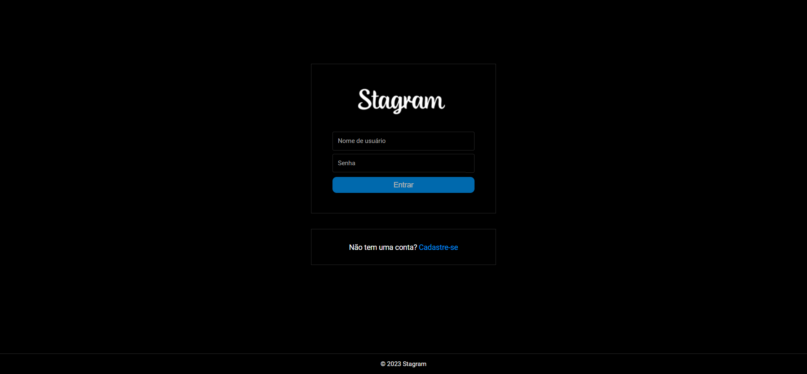
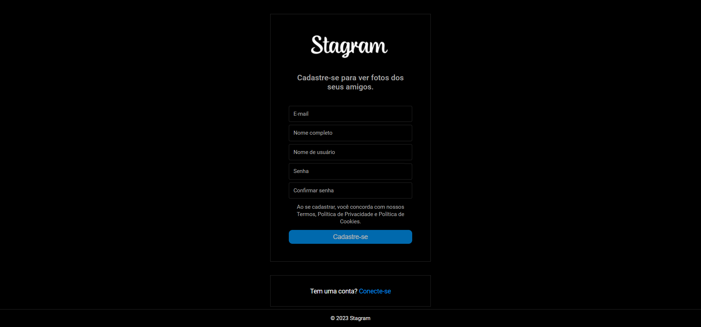
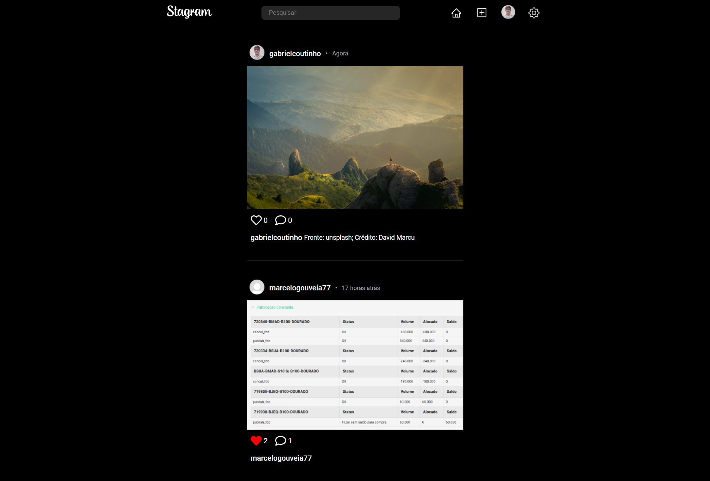
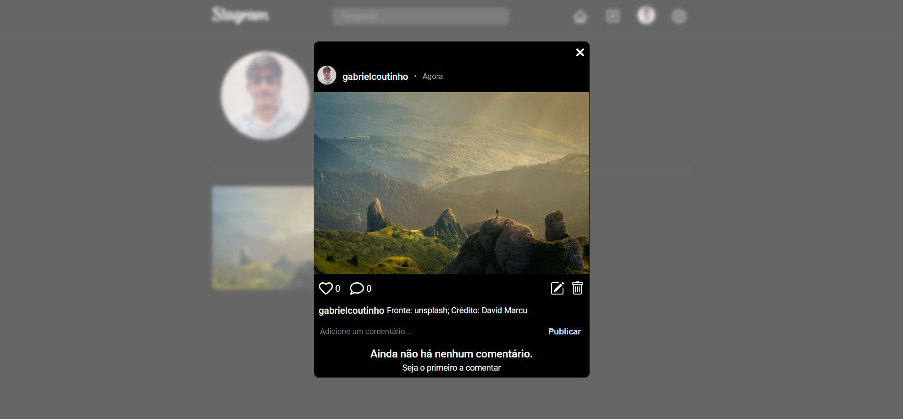
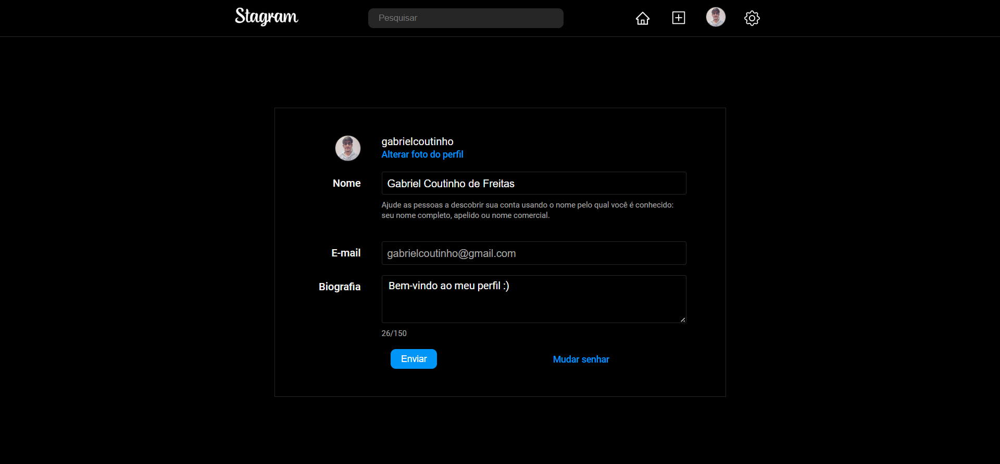

<p align="center">
  
</p>

<div>
  <h1 align="center">
      
      
      
      
      
  </h1>
</div>

<br>

## ⚙️ Tecnologias

Este projeto foi desenvolvido utilizando:

Back-end:

- [Node.JS](https://nodejs.org/pt-br/)
- [TypeScript](https://www.typescriptlang.org/)
- [Mongoose](https://mongoosejs.com/)
- [MongoDB](https://cloud.mongodb.com/)
- [Express](https://expressjs.com/pt-br/)
- [bcryptjs](https://github.com/dcodeIO/bcrypt.js)
- [JSONwebtoken](https://github.com/auth0/node-jsonwebtoken)

Front-end:

- [ReactJS](https://reactjs.org/)
- [TypeScript](https://www.typescriptlang.org/)
- [React Icons](https://react-icons.github.io/react-icons/)
- [Redux Toolkit](https://redux-toolkit.js.org/)
- [React Router](https://reactrouter.com/en/main)
- [Vite](https://vitejs.dev/)

## 📌 Começando

### Pré-requisitos

- Instalar [Node.JS](https://nodejs.org/en)

Clone o projeto:

```bash
git clone https://github.com/gabrielcoutinh0/Stagram.git
cd Stagram
```

Configuração:

```bash
# Crie um arquivo .env na raiz do backend e configure as váriaveis de ambiente
PORT = 5000
FRONTEND_PORT = "http://localhost:5173"

# Usuário e senha do MongoDB
DB_USER = #userMongodb
DB_PASSWORD = #PasswordMongodb


#Pode utilizar o site: https://travistidwell.com/jsencrypt/demo/ para gerar um jwt seguro.
JWT_SECRET = jtwSecret


_________________


# Crie um arquivo .env na raiz do frontend e configure as váriaveis de ambiente
VITE_SERVER_ENDPOINT = "http://localhost:5000/api"
VITE_UPLOADS_SERVER = "http://localhost:5000/uploads"
```

Instale as dependências:

```bash
cd frontend
npm install
npm run dev

# Rodar o backend
cd backend
npm install
npm run server

```

## 🖼️ Inspiração

- [Instagram](https://www.instagram.com/)
- [Udemy](https://www.udemy.com/course/react-do-zero-a-maestria-c-hooks-router-api-projetos/)
